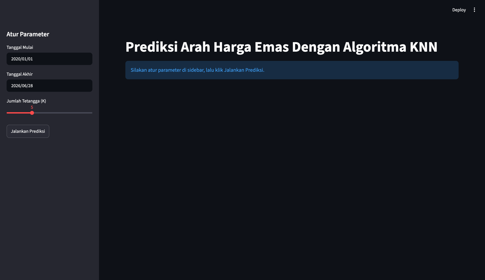
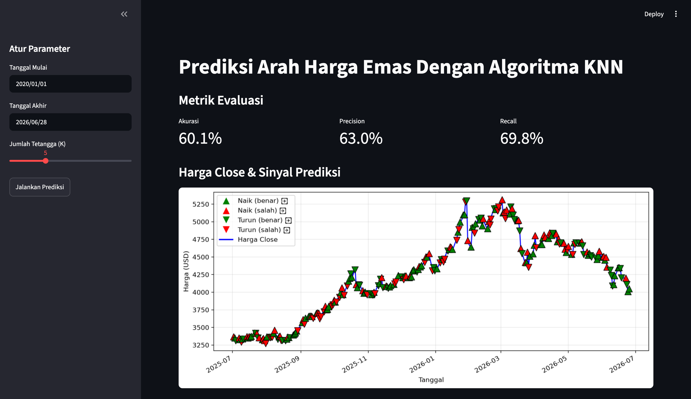

# Prediksi Arah Harga Emas (XAUUSD) dengan Algoritma KNN

Halo, perkenalkan saya Christian. Mahasiswa Informatika Udayana semester 2. Disini saya membuat sebuah program untuk memprediksi arah harga emas (XAUUSD) dengan memanfaatkan algoritma dari KNN. Jadi, program ini kana memprediksi arah harga emas pada esok hari, antara **naik atau turun** menggunakan algoritma **K-Nearest Neighbors (KNN)** yang dalam implementasinya sepenuhnya dibuat dari nol tanpa bantuan library machine learning. Data historis dari harga emas didapatkan dari library yakni `yfinance`.

Pendekatan KNN dipilih karena tidak memerlukan proses training. Model langsung membandingkan kondisi pasar hari ini dengan pola data historis yang paling mirip, lalu mengambil keputusan berdasarkan mayoritas dari **K** hari paling mirip tersebut.

---

## Fitur yang Digunakan

Terdapat 5 fitur utama yang digunakan dalam program ini, untuk mendapatkan hasil prediksi yang terbaik. Semua fitur ini dihitung menggunakan data historis, lalu dinormalisasi ke rentang 0–1 dengan **Min-Max Normalization**. Berikut merupakan fitur yang digunakan:

1. **Return 1 Hari**  
   `return_1 = (Close_hari_ini - Close_kemarin) / Close_kemarin`  
   Mengukur momentum jangka  pendek.

2. **MA5 Gap**  
   `ma5_gap = (Close - MA5) / MA5`  
   Posisi harga relatif terhadap tren 5 hari terakhir.

3. **MA20 Gap**  
   `ma20_gap = (Close - MA20) / MA20`  
   Posisi harga relatif terhadap tren 20 hari terakhir.

4. **Volatility**  
   `volatility = (High - Low) / Close`  
   Tekanan pasar hari ini.

5. **RSI 14**  
   `RSI = 100 - (100 / (1 + RS))`  
   Kondisi overbought/oversold.

Semua fitur dihitung dengan konsep **sliding window** (running sum) untuk efisiensi.

---

## Algoritma KNN

Untuk membentuk algoritma KNN, algoritma ini terbagi menjadi beberapa bagian, yakni:

- **Euclidean Distance**: menghitung jarak antara dua vektor fitur berdimensi 5.
- **Bubble Sort**: mengurutkan jarak untuk mencari K tetangga terdekat.
- **Majority Vote**: Sejumlah K tetangga melakukan voting, kelas dengan suara terbanyak menjadi prediksi.

---

## 📁 Struktur Folder

```
KNN-Gold-Prediction/
│
├── app.py                  # Dashboard interaktif dengan Streamlit
├── main.py                 # Versi terminal (tanpa visualisasi)
├── requirements.txt        # Daftar dependensi
├── README.md               # Dokumentasi ini
│
├── data/
│   └── gold_data.csv       # Data historis XAUUSD
│
└── src/
    ├── __init__.py          # Menandai folder sebagai package
    ├── fetch.py             # Ambil data dari Yahoo Finance dan menjadikannya CSV
    ├── features.py          # Hitung 5 fitur
    ├── knn.py               # Implementasi KNN
    ├── evaluation.py          # Metrik evaluasi (akurasi, presisi, recall)
    └── normalize.py         # Normalisasi Min-Max
```

---

## Cara Menjalankan

### 1. Clone / Download repositori

```bash
git clone https://github.com/midocristo/KNN-Gold-Prediction
cd KNN-Gold-Prediction
```

### 2. Install dependensi

```bash
pip install -r requirements.txt
```

### 3. (Opsional) Ambil data terbaru

Jika file `data/gold_data.csv` belum ada atau ingin memperbarui data:

```bash
python src/fetch.py
```

### 4. Jalankan versi terminal

```bash
python main.py
```

Output akan menampilkan akurasi, presisi, dan recall di terminal.

### 5. Jalankan dashboard

```bash
streamlit run app.py
```

Dashboard akan terbuka di browser dengan parameter:
- Rentang tanggal (filter data)
- Nilai K (jumlah tetangga)
- Tombol eksekusi
- Tampilan metrik + grafik harga dengan sinyal prediksi

---

## Tampilan Streamlit

### Memasuki Streamlit


### Tampilan Hasil


---

## Hasil Program Terminal

Hasil bervariasi tergantung rentang data dan nilai K. Contoh output terminal:

```
Data loaded: 1258 hari
Akurasi  : 52.34%
Precision: 55.12%
Recall   : 48.31%
```

---

## Kustomisasi

- **Ubah nilai K** di `main.py` atau slider di `app.py`.
- **Tambah fitur baru** — tambahkan fungsi di `features.py` dan sesuaikan `merge_label`.
- **Ganti metode normalisasi** — modifikasi `normalize.py`.
- **Gunakan sorting lain** — ganti `bubble_sort` dengan `list.sort()` atau implementasi quicksort sendiri.

---

## Lisensi

Proyek ini dibuat untuk tujuan edukasi dan pengembangan portofolio. Bebas digunakan dan dimodifikasi.

---
